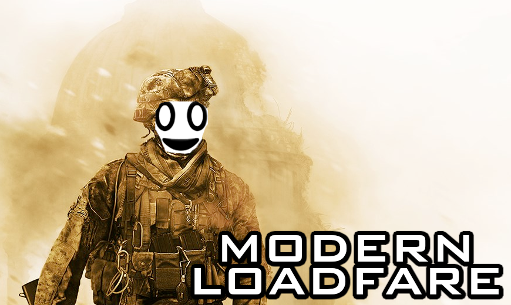

# Modern Loadfare: universal Xbox 360 CB bootloader patcher

Modern Loadfare is [elpiss](https://github.com/wurthless-elektroniks/elpiss) taken to its logical extreme. It's
designed to patch virtually every CB revision for use in RGH scenarios.

In short, older CBs are faster but less compatible, and newer CBs are slower but more compatible.
For example, CB 1940 boots Xenons almost as quickly as Jaspers normally do, and CB 7378 takes about three times as long.

Note that this is still a work in progress, many CBs are currently unsupported, and things are a bit buggy, so use everything
here at your own risk.

## License

Public domain
